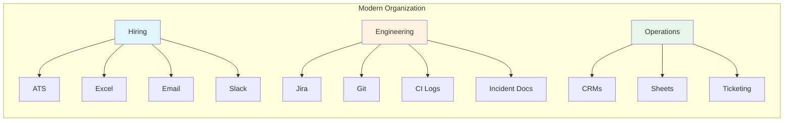
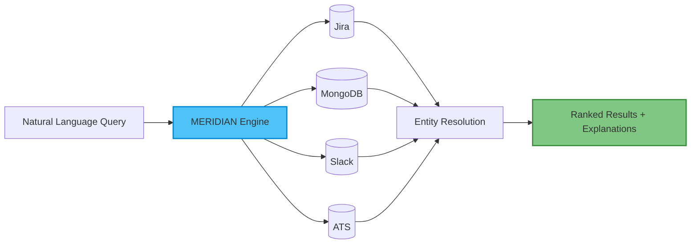
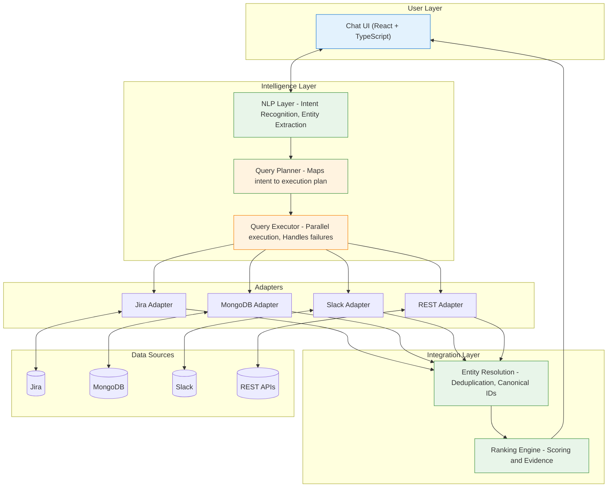
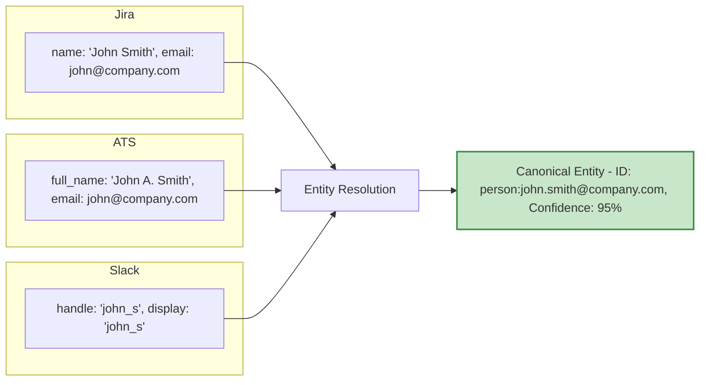
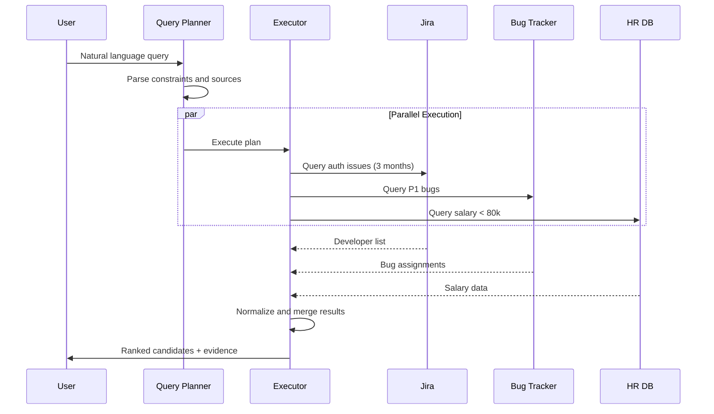
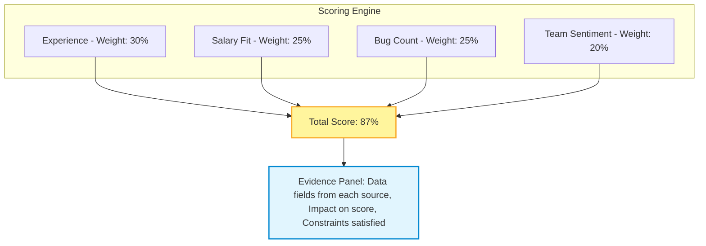
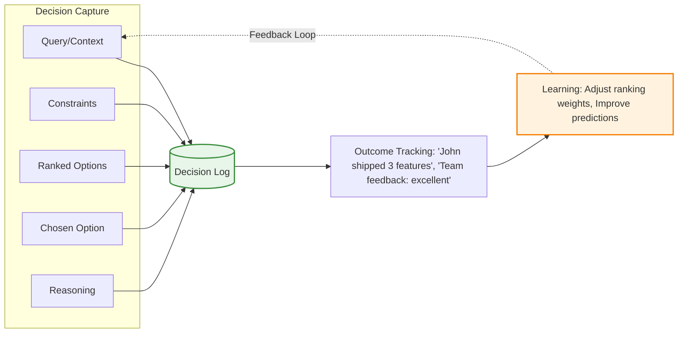
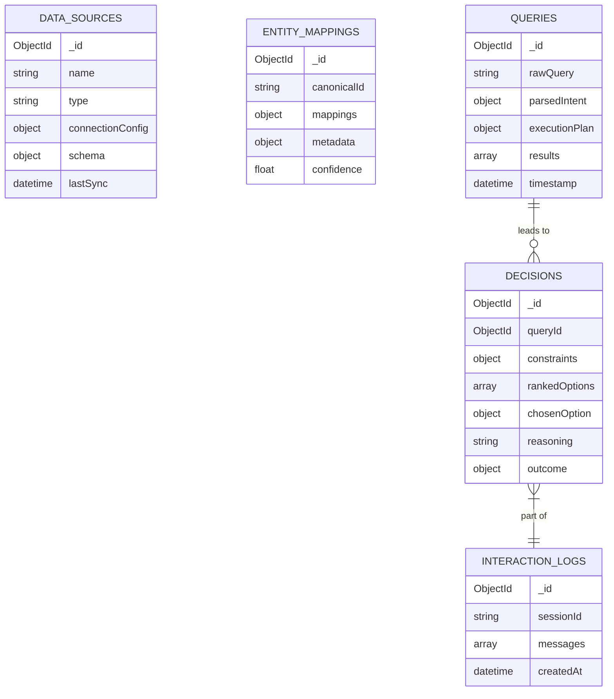
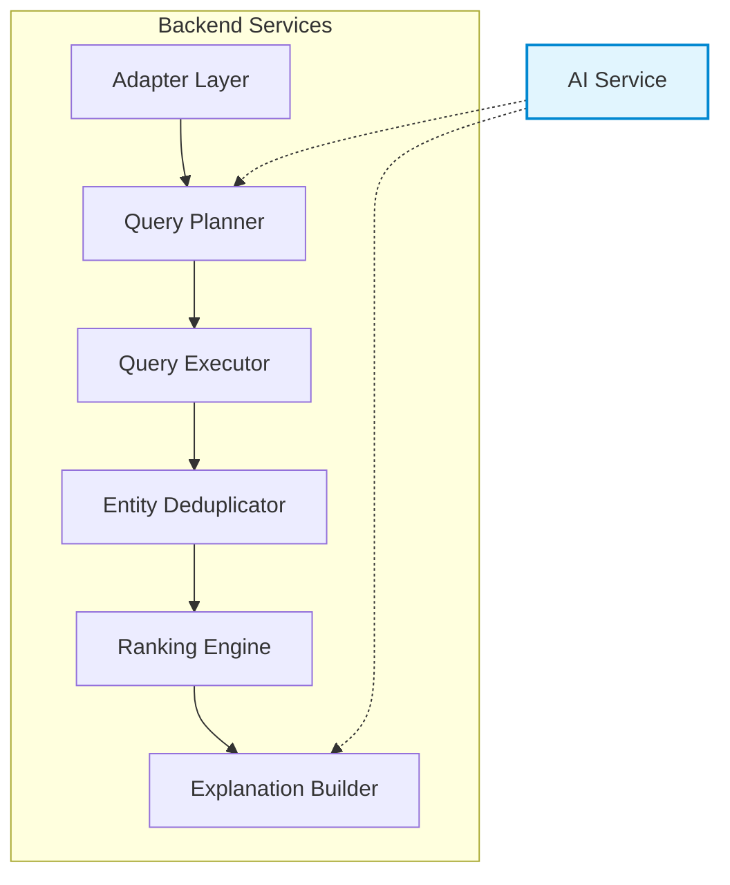
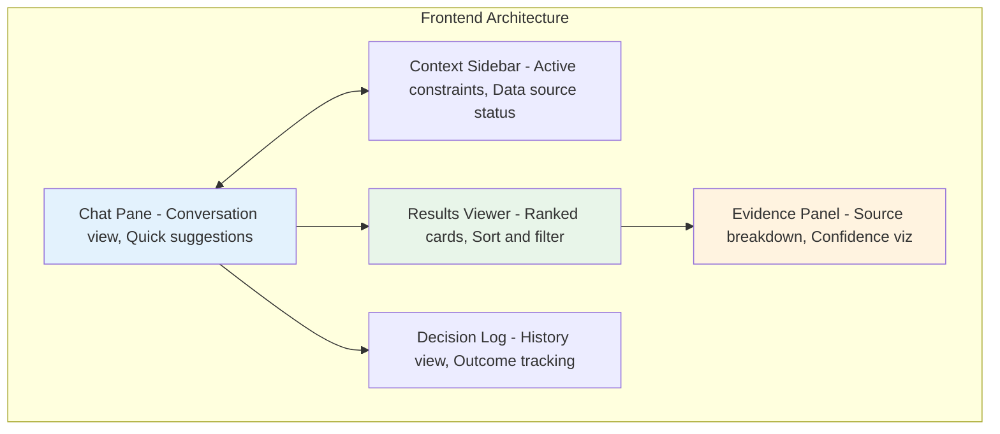

# MERIDIAN


## Multi-Source AI Decision Assistant

MERN + TypeScript · Agentic Orchestration · Multi-DB Reasoning

[](https://www.typescriptlang.org/)
[](https://reactjs.org/)
[](https://nodejs.org/)
[](https://www.mongodb.com/)
[](https://expressjs.com/)

[](LICENSE)
[](http://makeapullrequest.com)

---

**MERIDIAN** is an advanced, production-grade chatbot system that connects to multiple heterogeneous data sources (Jira, MongoDB, ATS, Slack, etc.), unifies entities across them, and answers high-stakes decision queries with **ranked, explainable recommendations** instead of simple Q&A.

> Think of it as an _intelligent data fabric + reasoning layer_ you query via chat.

---

## Table of Contents

- [Problem and Motivation](#problem-and-motivation)
- [What MERIDIAN Does](#what-meridian-does)
- [High-Level Architecture](#high-level-architecture)
- [Core Features](#core-features)
- [Data Model](#data-model)
- [Backend Responsibilities](#backend-responsibilities)
- [Frontend Responsibilities](#frontend-responsibilities)
- [Setup](#setup)
- [License](#license)

---

## Problem and Motivation

Modern teams run on **fragmented tools**:



### Example Complex Query

> _"Who is the best developer to lead the new authentication project, with >3 years of relevant experience, good team feedback, and no critical open bugs?"_

**To answer this manually, someone must:**

1. Query multiple tools one by one
2. Stitch context together in their head
3. Justify the final choice without clear evidence

### The Problem with Current Solutions

**Current Pain Points:**

| Challenge | Description |
| --------- | ----------- |
| Manual Queries | Query multiple tools one by one |
| Mental Stitching | Stitch context in your head |
| No Audit Trail | Justify choices without evidence |

**Existing Chatbot Limitations:**

| Limitation | Impact |
| ---------- | ------ |
| Single DB only | Can't aggregate across tools |
| No entity resolution | Same person = different records |
| No decision context | Forgets past interactions |
| No explainability | Black-box answers |

### MERIDIAN Solves This

---

## What MERIDIAN Does

### Multi-Source Orchestration

One natural language question → parallel queries over multiple data sources (MongoDB, Jira, REST APIs, etc.).

### Entity Resolution

Unifies "John Smith" from ATS, `john.smith` from Jira, and `john_s` from Slack into a single canonical entity with confidence scores.

### Constraint-Aware Reasoning

Applies constraints like "salary < 80k" or ">3 years experience" across _all_ relevant sources and re-plans queries when constraints change.

### Explainable Ranking

Returns a ranked list of options with an evidence trail: which data source contributed what, and how it affected the score.

### Decision Logging and Learning

Logs decisions and later outcomes ("we hired John; performance excellent"), so the system can learn which signals predict good decisions.

> **This is not a ChatGPT wrapper** — it is a _system for reasoning over messy, distributed operational data._

### Data Flow Overview



---

## High-Level Architecture



### Tech Stack

| Component | Technology |
| --------- | ---------- |
| Frontend | React |
| Language | TypeScript |
| Backend | Node.js |
| API | Express |
| Database | MongoDB |
| AI/LLM | Abstracted |

---

## Core Features

### Source Configuration and Adapters

Each external system (Jira, internal Mongo, Airtable, generic REST) is represented as a **DataSource**:

```typescript
type SourceType = 'jira' | 'mongodb' | 'airtable' | 'rest' | 'slack';
```

**Adapter Interface:**

```typescript
interface SourceAdapter {
  connect(): Promise<void>;
  disconnect(): Promise<void>;
  getSchema(): Promise<Schema>;
  queryEntity(constraints: Constraint[], fields: string[]): Promise<Entity[]>;
  search(term: string, fields: string[]): Promise<Entity[]>;
  getEntity(id: string): Promise<Entity>;
}
```

> This makes the AI layer **source-agnostic**.

---

### Entity Resolution

**Goal:** Unify records across systems representing the same entity.



**Approach:**

- Levenshtein similarity on names
- Exact match on email/phone when available
- Threshold-based matching
- Persistent mappings with confidence scores

**Entity Mapping Schema:**

```json
{
  "canonicalId": "person:john.smith@company.com",
  "mappings": {
    "jira-prod": "user-123",
    "ats": "cand-456",
    "slack": "U789"
  },
  "metadata": {
    "email": "john.smith@company.com",
    "name": "John Smith"
  },
  "confidence": 0.95
}
```

---

### Multi-Source Query Orchestration

**Example Query:**

> "Show me developers who worked on authentication in the last 3 months, have no open P1 bugs, and salary < 80k."



**Key Capabilities:**

| Feature | Description |
| ------- | ----------- |
| Smart Planning | Determines relevant sources per constraint |
| Parallel Execution | Queries all sources simultaneously |
| Fault Tolerance | Handles partial failures gracefully |

---

### Ranking and Explanation

Each option is scored across multiple criteria:



---

### Decision Logging and Learning



---

## Data Model

MongoDB Schema (Sketch):



---

## Backend Responsibilities

**Node.js + Express + TypeScript**

### API Endpoints

| Endpoint | Method | Description |
| -------- | ------ | ----------- |
| `/api/sources` | GET, POST, PUT, DELETE | CRUD for data sources |
| `/api/chat/query` | POST | Main chat endpoint |
| `/api/decisions` | GET, POST | Decision logging |
| `/api/entities` | GET | Entity resolution info |

### Core Services



### Security and Infrastructure

| Feature | Implementation |
| ------- | -------------- |
| Authentication | JWT-based auth |
| API Keys | Encrypted storage |
| Rate Limiting | Express middleware |
| Observability | Logging and metrics |

---

## Frontend Responsibilities

**React + TypeScript**

### UI Components



### UI/UX Goals

| Goal | Description |
| ---- | ----------- |
| Glassmorphism | Modern, translucent UI elements |
| Smooth Transitions | Fluid animations between states |
| Motion Feedback | Subtle loading indicators during queries |
| Responsive | Works across desktop and tablet |

---

## Setup

### Prerequisites

- Node.js v18+
- MongoDB (local or Atlas)
- npm or yarn

### Backend Setup

```bash
# Create and navigate to backend directory
mkdir backend && cd backend

# Initialize project
npm init -y

# Install dependencies
npm install express cors mongoose dotenv

# Install dev dependencies
npm install typescript ts-node-dev @types/node @types/express --save-dev

# Initialize TypeScript
npx tsc --init
```

**Backend Structure:**

```text
backend/
├── src/
│   ├── index.ts
│   ├── routes/
│   │   ├── sources.ts
│   │   ├── chat.ts
│   │   └── decisions.ts
│   ├── services/
│   │   ├── aiService.ts
│   │   ├── queryPlanner.ts
│   │   └── entityResolver.ts
│   ├── adapters/
│   │   ├── jiraAdapter.ts
│   │   ├── mongoAdapter.ts
│   │   └── slackAdapter.ts
│   ├── models/
│   │   └── ...
│   └── types/
│       └── ...
├── package.json
└── tsconfig.json
```

### Frontend Setup

```bash
# Create React app with TypeScript
npx create-react-app frontend --template typescript

# Navigate to frontend
cd frontend

# Install dependencies
npm install axios
```

**Frontend Structure:**

```text
frontend/
├── src/
│   ├── components/
│   │   ├── ChatPane/
│   │   ├── ContextSidebar/
│   │   ├── ResultsViewer/
│   │   ├── EvidencePanel/
│   │   └── DecisionLog/
│   ├── hooks/
│   │   └── useChat.ts
│   ├── services/
│   │   └── api.ts
│   ├── types/
│   │   └── index.ts
│   ├── App.tsx
│   └── index.tsx
├── package.json
└── tsconfig.json
```

### Quick Start

```bash
# Terminal 1: Start backend
cd backend
npm run dev

# Terminal 2: Start frontend
cd frontend
npm start
```

---

## License

This project is licensed under the MIT License - see the [LICENSE](LICENSE) file for details.

---

Made with love for intelligent decision-making

[Back to Top](#meridian)
